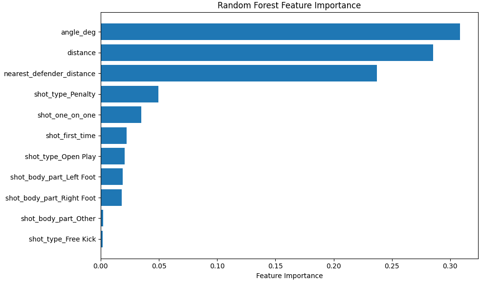
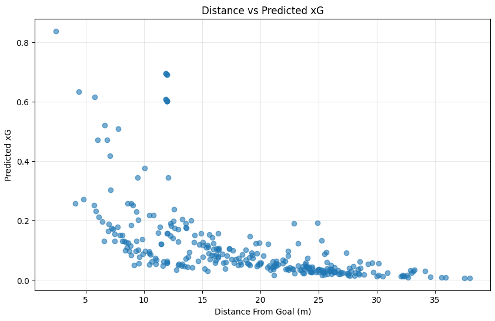

# Expected Goals (xG) Modeling using FIFA World Cup 2022 Data

## Overview

This project develops an Expected Goals (xG) model using StatsBomb FIFA World Cup 2022 event data.

The objective is to estimate the probability of a shot resulting in a goal using spatial and contextual football features.

---

## Dataset

Source: StatsBomb Open Data

Competition: FIFA World Cup 2022

Total Shots: 1,494

Target Variable:

* Goal = 1
* No Goal = 0

---

## Features

* Shot Distance
* Shot Angle
* Nearest Defender Distance
* Shot Body Part
* Shot Type
* First-Time Shot Indicator
* One-on-One Indicator

---

## Models

### Logistic Regression

ROC-AUC: 0.799

Brier Score: 0.086

### Random Forest

ROC-AUC: 0.806

Brier Score: 0.090

---

## Key Findings

* Shot angle was the most important predictor of goal probability.
* Shot distance was the second strongest predictor.
* Defender proximity significantly influenced scoring probability.
* Logistic Regression produced better-calibrated probabilities than Random Forest.

---

## Visualizations

### Calibration Curve

### Distance vs Predicted xG

---

## Future Work

* Compare model outputs with StatsBomb xG.
* Extend the framework to Expected Threat (xT).
* Implement VAEP for action valuation.
* Perform player-level and team-level offensive analysis.
